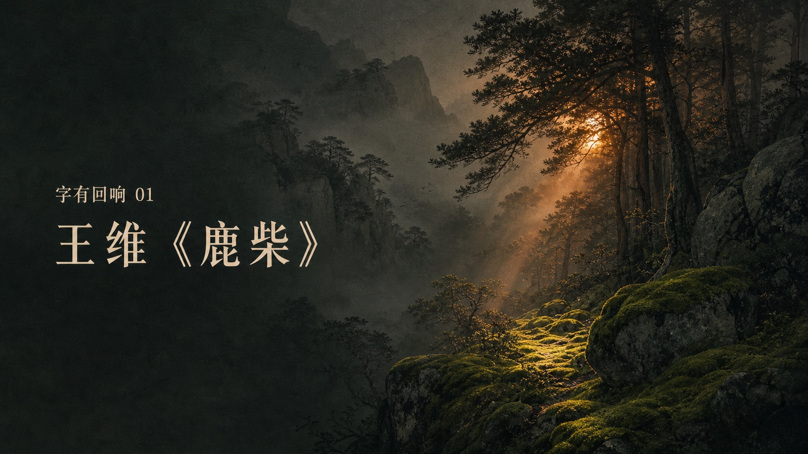
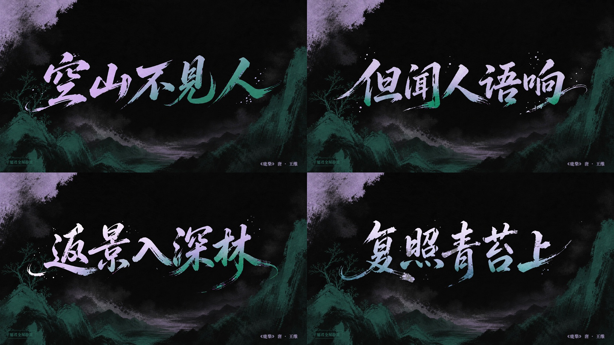
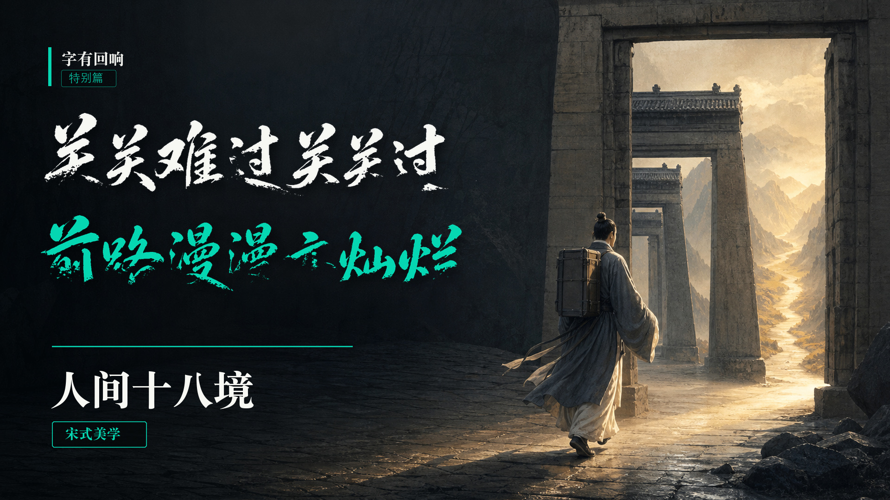
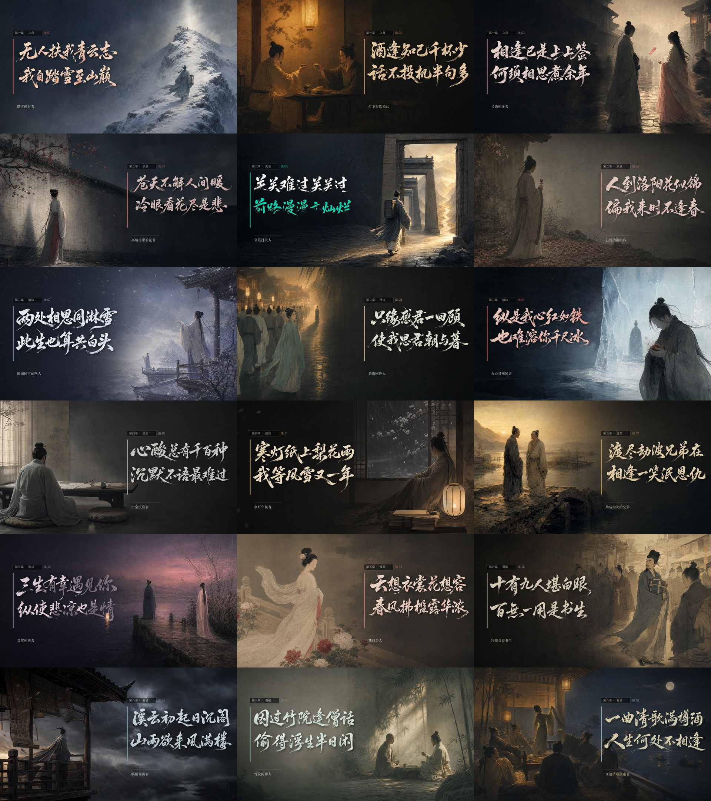

# Chinese Calligraphy Video

把诗词、古风短句和东方哲思内容，设计成具有中国色彩美学、书法气韵、意境画面和 TTS 的视频。

你只需要提供内容。Skill 会完成：

**内容分析 → 审美提案 → 关键画面 → GPT Image 生图 → 书法 → TTS → 封面 → 成片质检**

## 快速开始

在 Codex 中输入：

```text
使用 $chinese-calligraphy-video，把下面内容制作成中国书法视频。
先分析内容，提供 2–3 个审美方向并评分；我确认方向后，再生成关键画面、TTS、封面和视频。

标题：
作者或出处：
正文：
画幅：16:9 或 9:16
其他要求：
```

只提供正文也可以。书体、配色、人物、节奏和声音可由 Skill 根据内容判断。

## 工作流

### 1. 锁定原文

先核对正文、标点、标题和作者。短句合集需要明确说明“不是同一首诗”，避免错误归属。

### 2. 分析内容

从以下维度提取设计依据：

- 核心主题与主要意象。
- 情绪起点、转折与结尾。
- 时间、空间、光线和材质。
- 声律、停顿和观看路径。
- 需要强调或克制的文化符号。

### 3. 比较审美方向

提出 2–3 个完整方案。每个方案包含：

- 主导审美与设计命题。
- 书体和辅助字体。
- 两个中国传统颜色及各自职责。
- 人物、背景、构图和留白。
- 显字、切镜和停留节奏。
- TTS 声线、情绪和语速。
- 禁止出现的元素。
- 审美评分与推荐理由。

### 4. 确认方向

选择一个方向，并明确保留项与禁用项：

```text
选择方向 1。
保留雪青×石绿、深墨留白和现代狂草；不要人物、鹿、亭台、印章和金色装饰。
```

### 5. 先看关键画面

长视频先生成三张图：

- 第一镜：确认系列气质。
- 转折镜：确认人物、配色和力度。
- 收尾镜：确认情绪是否落稳。

```text
先生成第一镜、最强转折镜和最后一镜。背景不要写字，正文使用单独书法母版。
```

### 6. 生成全片与 TTS

关键画面确认后，先生成一句 TTS 试听。确认声线、情绪和语速后，再生成所有镜头与逐句朗诵。

```text
视觉方向确认。先生成第一句 TTS 试听，使用清冷温润的青年男声，语速略慢、表达克制。
试听确认后，继续生成全部镜头和逐句 TTS；每句结尾保留自然呼吸。
```

### 7. 封面与质检

```text
生成可直接用于微信视频号的封面。
主标题必须在缩略图尺寸下看清，不要堆制作说明。
最后从实际视频抽帧检查文字、配色、显字时机和 TTS 对齐。
```

最终交付通常包括：视频、封面、关键画面、全片合图、逐句 TTS、设计说明和发布简介。

---

## 示例一：空见｜王维《鹿柴》



### 使用指令

```text
使用 $chinese-calligraphy-video，把王维《鹿柴》做成《字有回响》第一期。
先分析声音、光线和寂静之间的关系，再提供审美方向。
我喜欢现代狂草和雪青×石绿，但不要人物、鹿、亭台和印章。

空山不见人，
但闻人语响。
返景入深林，
复照青苔上。
```

### 设计结果

**雪青石绿 · 寂照狂草**，评分 `93.5/100`。

| 设计项 | 选择 |
|---|---|
| 内容主线 | 寂静 → 人声 → 返照 → 青苔 |
| 书法 | 现代狂草；前两句起势，后两句归静 |
| 主色 | 雪青 `#B6A7D4`：人声、返照、主要识别 |
| 辅色 | 石绿 `#2D6A5F`：深林、青苔、收笔回声 |
| 构图 | 深墨空山，一镜一句，大面积留白 |
| TTS | 清冷温润青年男声，语速 0.88，句间留白 |
| 禁止 | 人物、鹿、亭台、印章、霓虹、金色边框 |



狂草承接“人语响”和“返景”的瞬时力量，最后在“复照青苔上”减速、下沉并归静。

---

## 示例二：《字有回响》03｜人间十八境



### 使用指令

```text
使用 $chinese-calligraphy-video，把下面十八句话制作成宋式人物快闪视频。
这些不是同一首诗，而是一组串联短句。
每个句号一境，每境一个鲜明角色、一组传统双色和一个动作；正文使用狂草。
先找出贯穿十八句的精神路径，再设计每一境。
```

### 工作流结果

Skill 先将十八句整理为：

**独行 → 入世 → 情生 → 执念 → 劫后 → 看破 → 清欢**

入选方向：**宋画十八境 · 人间一念禅**，评分 `94/100`。

- 每镜一个身份、一个动作、一个念头。
- 人物与文字左右错位，保留深色负空间。
- 每镜一组传统双色，整体保持宋画人物比例和纸墨材质。
- 禅意通过缘、执、渡、空、照和放下表达，不堆佛像。
- 十八句使用同一狂草骨架和统一的青年男声 TTS。

### 十八境

| # | 境名 | 原文 | 画面核心 |
|---:|---|---|---|
| 01 | 青云独行 | 无人扶我青云志，我自踏雪至山巅。 | 踏雪登峰，独自立志 |
| 02 | 知己对饮 | 酒逢知己千杯少，话不投机半句多。 | 杯盏分合，辨认真知己 |
| 03 | 上签相逢 | 相逢已是上上签，何须相思煮余年。 | 签前相逢，缘起不执 |
| 04 | 冷眼悲花 | 苍天不解人间暖，冷眼看花尽是悲。 | 冷院看花，人间失温 |
| 05 | 破关前行 | 关关难过关关过，前路漫漫亦灿烂。 | 穿过重门，前路见光 |
| 06 | 洛阳失春 | 人到洛阳花似锦，偏我来时不逢春。 | 繁花盛景，个人失意 |
| 07 | 同雪白头 | 两处相思同淋雪，此生也算共白头。 | 两处空间，同一场雪 |
| 08 | 一顾相思 | 只缘感君一回顾，使我思君朝与暮。 | 一次回眸，延展朝暮 |
| 09 | 赤心寒冰 | 纵是我心红如铁，也难溶你千尺冰。 | 赤心与寒冰正面冲撞 |
| 10 | 沉默心酸 | 心酸总有千百种，沉默不语最难过。 | 空室沉默，无言最重 |
| 11 | 寒灯守候 | 寒灯纸上梨花雨，我等风雪又一年。 | 寒灯书写，风雪等待 |
| 12 | 劫后一笑 | 渡尽劫波兄弟在，相逢一笑泯恩仇。 | 劫后相逢，一笑完成转渡 |
| 13 | 三生有幸 | 三生有幸遇见你，纵使悲凉也是情。 | 承认悲凉，也珍惜相遇 |
| 14 | 云裳花容 | 云想衣裳花想容，春风拂槛露华浓。 | 春风花下，进入盛美 |
| 15 | 书生冷眼 | 十有九人堪白眼，百无一用是书生。 | 孤傲书生，自嘲自省 |
| 16 | 风满高楼 | 溪云初起日沉阁，山雨欲来风满楼。 | 高楼观风，风雨压境 |
| 17 | 竹院清谈 | 因过竹院逢僧话，偷得浮生半日闲。 | 竹院清谈，节奏放慢 |
| 18 | 清歌重逢 | 一曲清歌满樽酒，人生何处不相逢。 | 江边重逢，以清欢收束 |



十八镜各有角色与意境，同时以宋式人物、深色留白、狂草和章节标签保持同一世界。

### 声音与节奏

- 声音：清冷温润的青年男声，表达克制、不过度煽情。
- 语速：略慢，给长句和狂草留出辨认时间。
- 结构：十八句独立朗诵，每句结尾保留呼吸。
- 节奏：前段推进，中段情绪加深，第十七境放慢，第十八境延长停留。
- 收束：以“一曲清歌”和“人生何处不相逢”完成清欢落点。

## 验收标准

- [ ] 原文、标点、标题和作者准确。
- [ ] 内容具有清晰主题和情绪路径。
- [ ] 书体、双色、人物和节奏均有内容依据。
- [ ] 两个颜色职责明确，有主次关系。
- [ ] 狂草有气势，但主体字形可辨。
- [ ] 没有错字、漏字、多余汉字、印章或水印。
- [ ] TTS 声线统一，逐句朗诵完整，停顿自然。
- [ ] 已从最终视频抽帧检查文字和配色。
- [ ] 封面标题在手机缩略图中清楚。
